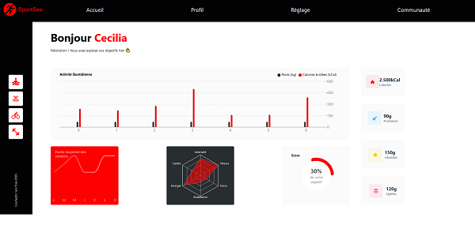
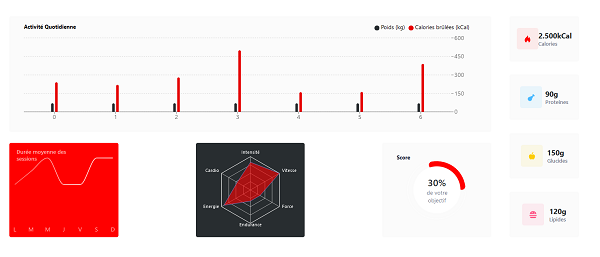

# Sportsee Front-End

## Description

SportSee is an analytics dashboard that allows users to track their physical progress through multiple data points. Easy to use, the data is displayed on graphs.

Developed with React, CSS, and Recharts as the charting library, the site presents informations in a structured manner. Data is retrieved via API calls using the fetch method.

## Stack

-   React
-   CSS
-   Recharts
-   Figma

## Lessons Learned

During this project, I learned how to use Recharts and create custom hooks to fetch data from the provided back-end solution.

## Screenshots

Home page 1  

Home page 2  

## Authors

[Yacine D](https://github.com/Yacine-Di)
